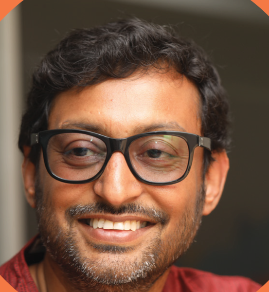
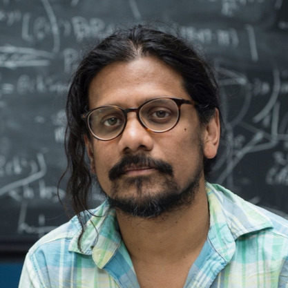
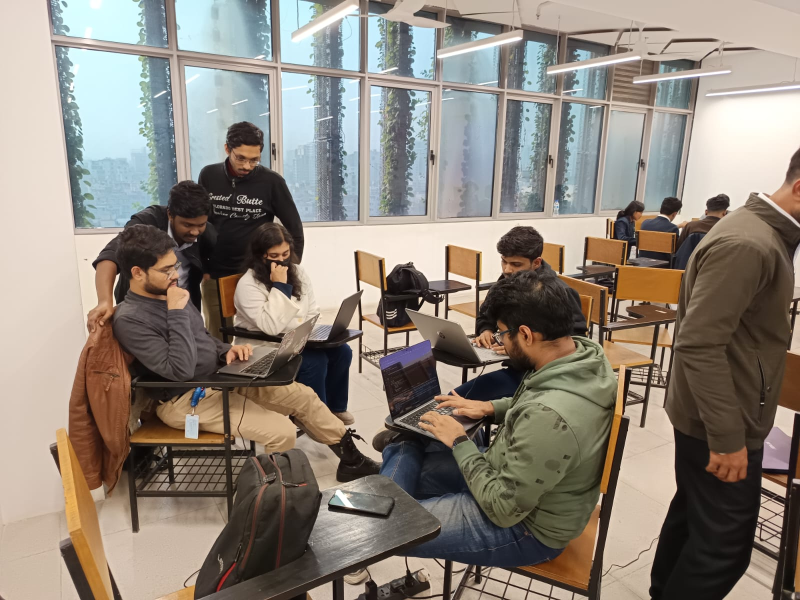
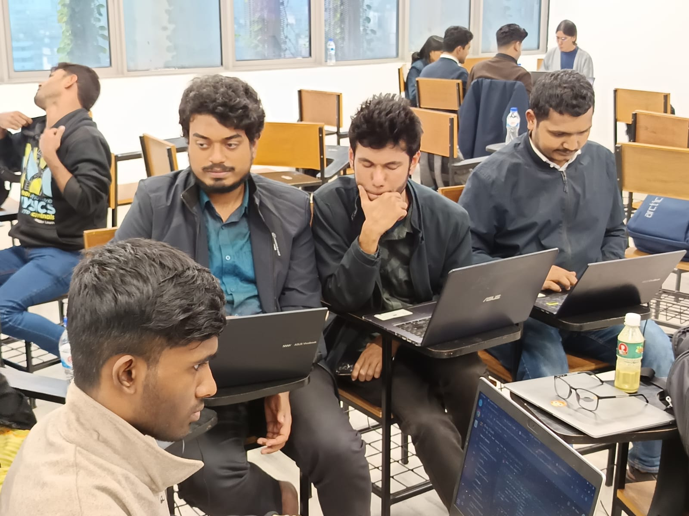
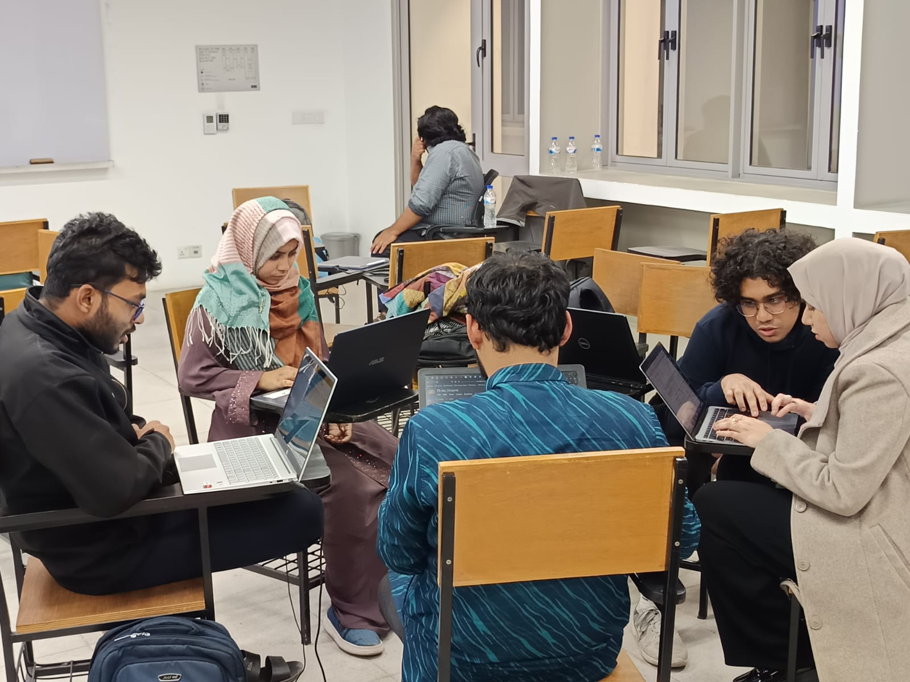
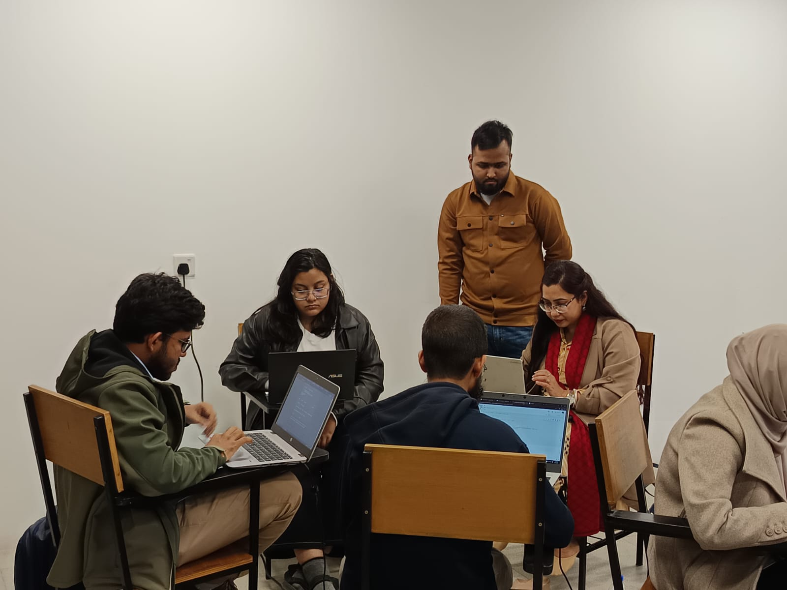
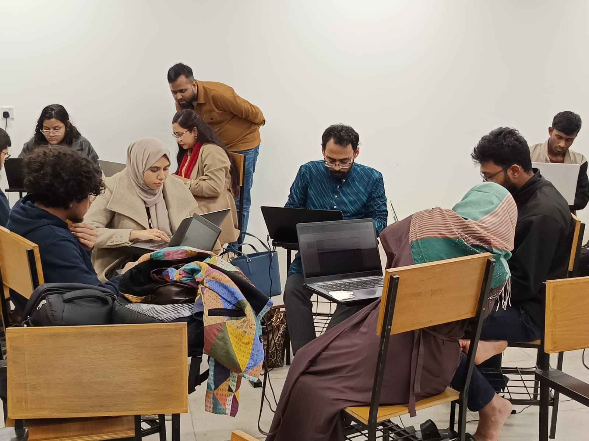
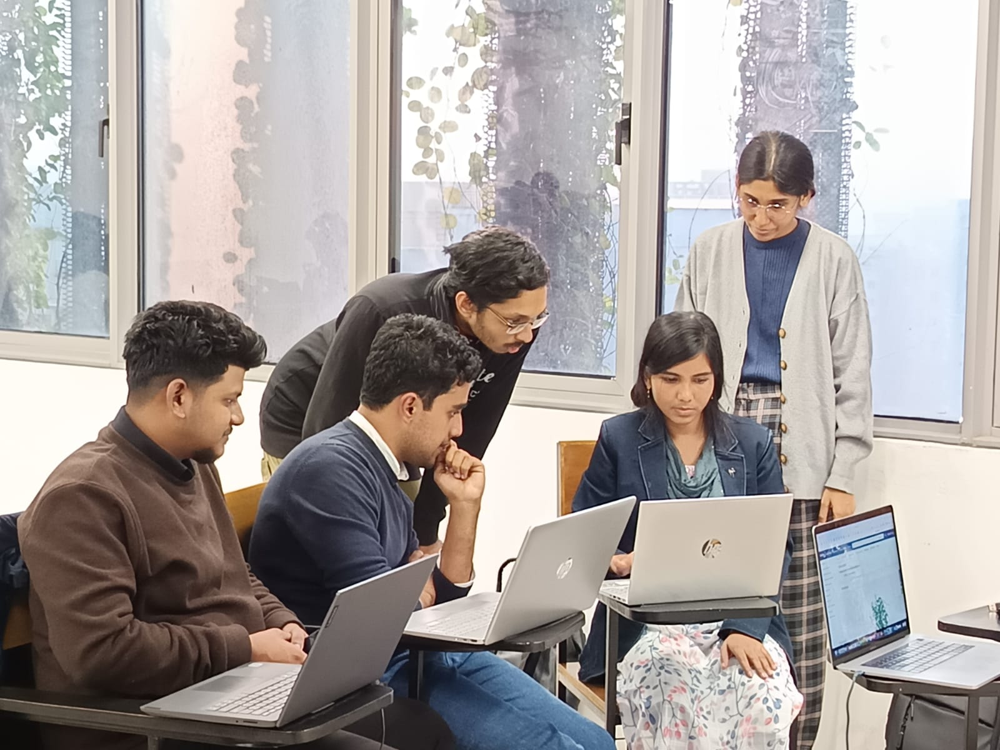

<h1 style="text-align: center;">Speakers</h1>

  

    
    

      
<strong>Prof. Amitava Roy</strong>

      
Faculty Affiliate

      
Department of Biomedical and Pharmaceutical Sciences, University of Montana, USA

    

  

  

    
    

      
<strong>Prof. Amin Ahsan Ali</strong>

      
Professor

      
Dept of CSE and Director AI and ML Wing, Center for Computational & Data Sciences (CCDS), Independent University, Bangladesh

    

  

  

    
    

      
<strong>Prof. Tibra Ali</strong>

      
Professor and Associate Dean (Research)

      
Dept of Math. and Natural Sciences, BRAC University, Bangladesh

    

  

<h1 style="text-align: center;">Instructors</h1>

  

    
    

      
<strong>Rafat Hasan Khan</strong>

      
Research Assistant

      
Center for Computational & Data Sciences (CCDS), Independent University, Bangladesh

    

  

  

    
    

      
<strong>Mir Sazzat Hossain</strong>

      
Research Assistant

      
Center for Computational & Data Sciences (CCDS), Independent University, Bangladesh

    

  

  

    
    

      
<strong>Md Sakibul Islam</strong>

      
Computational Biologist

      
Gene Reveal

    

  

  

    
    

      
<strong>Sahadot Hossen</strong>

      
Computational Biologist

      
Gene Reveal

    

  

<h1 style="text-align: center;">Workshop Schedule</h1>

  

    <strong>Day 1</strong> 
    Date: January 08, 2025 
    Time: 9:30 AM - 5:00 PM
  

  

    <strong>Day 2</strong> 
    Date: January 09, 2025 
    Time: 9:30 AM - 5:00 PM
  

  

    <strong>Day 3</strong> 
    Date: January 10, 2025 
    Time: 9:30 AM - 5:00 PM
  

---

<h1 style="text-align: center;">Workshop Overview</h1>

## Day 1

  

    <ul>
      <li>Introduction to Computational Biology by Prof. Amitava Roy</li>
      <li>Hands-on Session: <a href="https://www.rcsb.org/">Protein Data Bank (PDB)</a>, <a href="https://www.uniprot.org/">UniPort</a>, <a href="https://www.cgl.ucsf.edu/chimerax/">UCSF ChimeraX</a></li>
    </ul>
  

  

    <embed src="files/slides/intro_compbio.pdf" width='500rem' height='300rem' />
    <!-- <embed src="files/slides/What_is_archived_in_PDB.pdf" width='500rem' height='300rem' /> -->
  

---

## Day 2

  

    <ul>
      <li>Introduction to AI and ML by Prof. Amin Ahsan Ali</li>
      <li>Hands-on Session: ML tools on GO-terms</li>
    </ul>
  

    

    <embed src="files/slides/Intro to AI_ML_Compbio.pdf" width='500rem' height='300rem' />
    

---

## Day 3

  

    <ul>
      <li>Participants work on real-life use case tasks using databank websites and ML tools</li>
    </ul>
  

  

    <embed src="files/slides/Day3.pdf" width='500rem' height='300rem' />
  

---

## Resources

- [Introduction to Computational Biology](files/slides/intro_compbio.pdf) [slides]
- [What is archived in PDB](files/slides/What_is_archived_in_PDB.pdf) [slides]
- [Introduction to AI and ML](files/slides/Intro to AI_ML_Compbio.pdf) [slides]
- [View Notebooks - Day 2](files/notebooks/day_02.ipynb) [notebook]
- [Fun time - let's play with drugs!](files/slides/Day3.pdf) [slides]
- [View Notebooks - Day 3](files/notebooks/day_03.ipynb) [notebook]
- [CompBio Playbook](files/notebooks/playbook.ipynb) [notebook]

---

## Participants

### Group 1

  
<strong>Preeti Rani Pal</strong>

  
<strong>Md. Soriful Islam</strong>

  
<strong>Atanu Roy</strong>

  
<strong>Rahul Pal</strong>

### Group 2

  
<strong>Dr. Nilima Barman</strong>

  
<strong>Joyita Faruk</strong>

  
<strong>Warisul Imam</strong>

  
<strong>Md. Ashraful Islam</strong>

  
<strong>Tanver Hossain Refat</strong>

### Group 3

  
<strong>Md Ridwan</strong>

  
<strong>Tahira Jahan Hemi</strong>

  
<strong>Md. Hasibul Kabir</strong>

  
<strong>Md. Taraq Monoar</strong>

  
<strong>Ahadul Islam Tasin</strong>

### Group 4

  
<strong>Abdul Hannan Akib</strong>

  
<strong>Fahim Ahmed</strong>

  
<strong>Muhammad Abdullah</strong>

  
<strong>Mst. Razia Sultana Shamma</strong>

  
<strong>Fabiha Saiyara</strong>

### Group 5

  
<strong>Md. Akifur Rahman Farhan</strong>

  
<strong>Tandra Rani Das Banna</strong>

  
<strong>Manjurul Haque Chowdhury</strong>

  
<strong>Fabliha Afroza Chowdhury</strong>

---

## Event Photos

  
  
  
  
  
  

